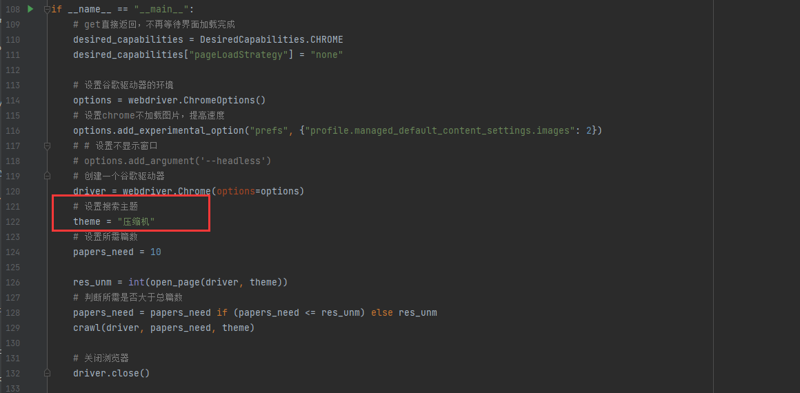
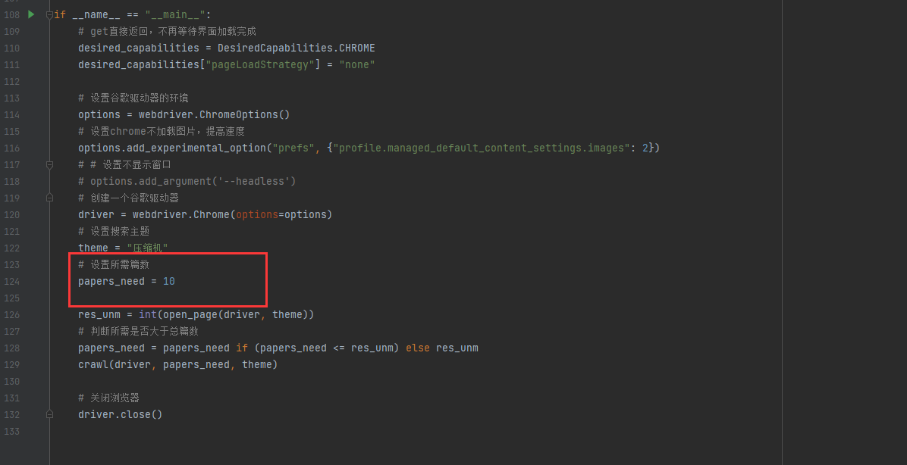
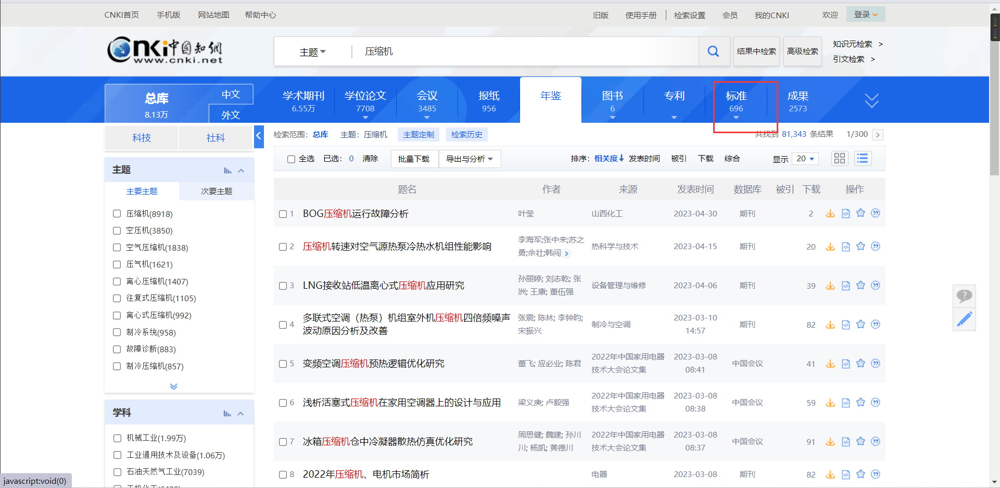
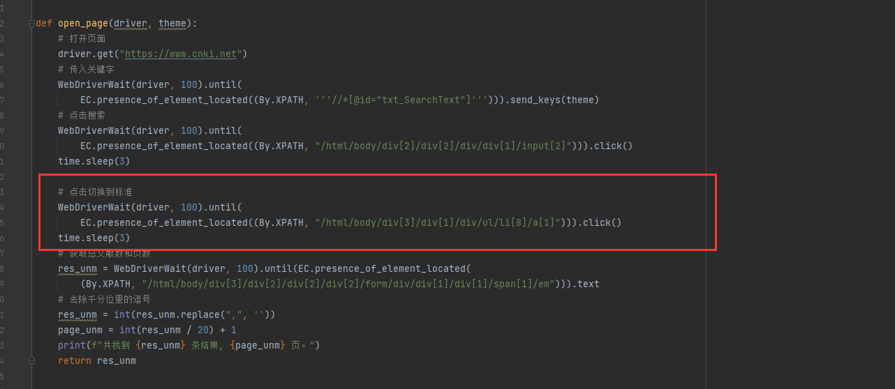
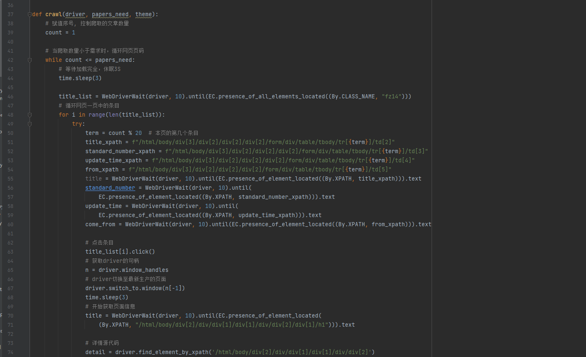

# zhiwang_spider
基于selenium的自动化知网文献爬虫

# 1、启动

修改想搜索的文献主题

设置需要的篇数

因为我需要的是标准里面的，所以我xpath到标准，如有需要采集别的自己去修改xpath

解析详情，因为详情的字段都不一样，如果按照位置取，可能数据就不干净，所以我只采集标题，时间这些，具体详情的代码全拉下来，以后做清洗，如果你们需要不同字段需要自己增加一下解析的xpath

